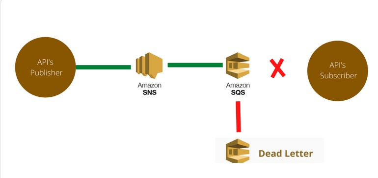
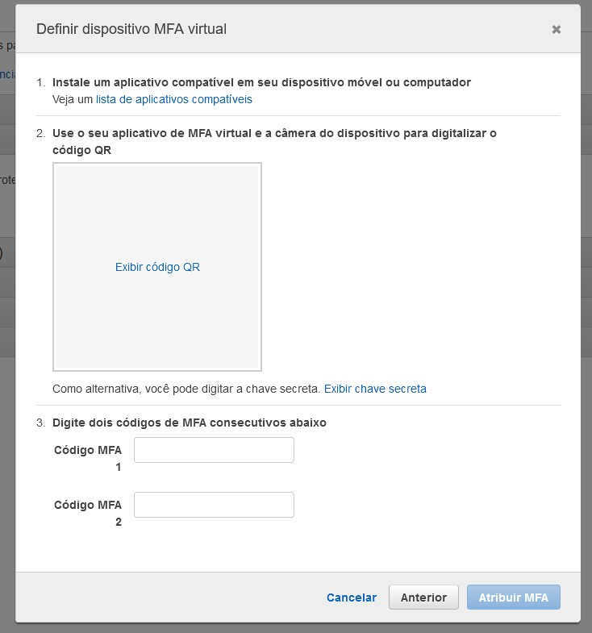
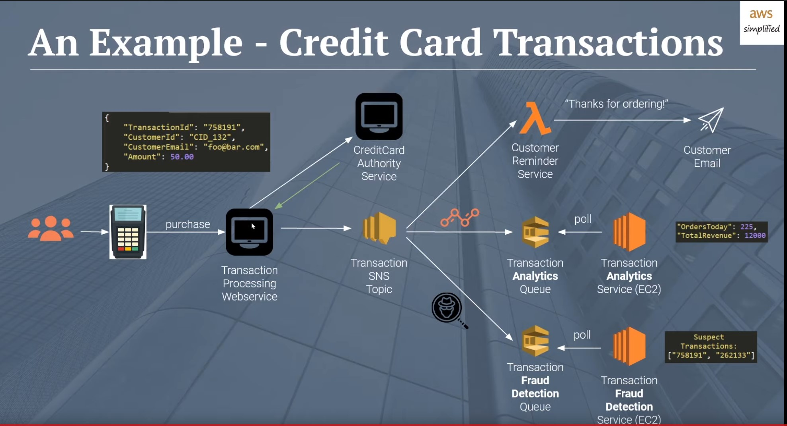

# Aula 2

## Ementa
 - Amazon SQS
 - Diferenças entre SQS / Rabbit / Kafka / Bull
 - Continuação do Desafio

# Amazon SQS

Amazon Simple Queue Service é um serviço de enfileiramento de mensagens rápido, confiável, escalável,
totalmente gerenciado que permite integrar e desacoplar sistemas de software e componentes distribuídos.
Ele oferece constructos comuns, como filas de mensagens mortas e tags de alocação de custos.
Ele fornece uma API de serviço da Web genérica e pode ser acessado por qualquer linguagem de programação compatível com o AWS SDK.

## Onde usar ?
Você pode usar o Amazon SQS para transmitir qualquer volume de dados, em qualquer nível de transferência.
Sem perder mensagens ou exigir que outros serviços estejam continuamente disponíveis.
Com o Amazon SQS, você pode descarregar a carga administrativa de operar e escalar um cluster de mensagens altamente disponível, pagando apenas um preço baixo pelo que você usa.
Deste modo permitindo que você mova dados entre componentes distribuídos para executar diferentes tarefas conforme necessário.

## O que é a fila SQS ?
Uma fila do Amazon SQS é basicamente um buffer entre os componentes do aplicativo que recebem dados e os componentes que processam os dados em seu sistema.
Se os seus servidores de processamento não puderem processar o trabalho com rapidez suficiente (talvez devido a um aumento no tráfego), o trabalho é enfileirado.
Assim para que os servidores de processamento possam chegar a ele quando estiverem prontos.
Isso significa que o trabalho não é perdido devido a recursos insuficientes.

## Garantia de Entrega
O Amazon SQS garante a entrega de cada mensagem pelo menos uma vez e oferece suporte a vários leitores e escritores que interagem com a mesma fila.
Uma única fila pode ser usada simultaneamente por muitos componentes de aplicativos distribuídos, sem necessidade de esses componentes se coordenarem entre si para compartilhar a fila.
Embora a maior parte do tempo cada mensagem seja entregue ao seu aplicativo exatamente uma vez.
Você deve projetar seu sistema para ser idempotente (ou seja, não deve ser afetado negativamente se processa a mesma mensagem mais de uma vez).

## Disponibilidade

O Amazon SQS é projetado para estar altamente disponível.
Deste modo entregar mensagens de maneira confiável e eficiente; no entanto, o serviço não garante a entrega de mensagens First In, First Out (FIFO).
Para muitas aplicações distribuídas, cada mensagem pode ficar sozinha e, se todas as mensagens forem entregues, a ordem não é importante.

## Preservar a ordem de mensagens

Você pode colocar as informações de seqüência em cada mensagem para que possa reordenar as mensagens quando elas são recuperadas da fila.
----

<https://www.youtube.com/watch?v=mXk0MNjlO7A>

Diferença entre SNS e SQS,
o SNS serve para notificar vários consumidores ao mesmo tempo, podendo ser um dos consumidores um SQS por exemplo, pois o SNS faz um esquema de push, já o SQS para conseguirmos acessar fazemos pull.

----
# AMQP
O AMQP é um protocolo que “roda acima” do protocolo TCP, que pertence à camada de transporte. Tal como o MQTT, o AMQP é um protocolo que permite o envio e recebimento de mensagens de forma assíncrona – ou seja, quando enviamos uma mensagem não esperamos uma resposta imediata – independente do hardware, sistema operacional e linguagem de programação. De forma bastante genérica (e com ressalvas: vide referências), o AMQP pode ser enxergado como o equivalente assíncrono do HTTP, onde um cliente é capaz de comunicar-se com um broker “no meio do caminho”.

O AMQP é um protocolo originalmente desenvolvido pela comunidade atuante no mercado financeiro, baseado no cliente (customer-driven) que visa permitir a interoperabilidade entre dispositivos. Atualmente, a versão do protocolo padronizada pela ISO/IEC 19464 é a 1.0. No entanto, este artigo baseia-se na utilização do RabbitMQ como broker de AMQP e, nativamente, este broker utiliza o AMQP 0-9-1 (embora também ofereça suporte ao AMQP 1.0). Desta forma, iremos focar no AMQP 0-9-1, que é bastante utilizado no RabbitMQ e em outros brokers.

# Rabbit MQ

<https://www.youtube.com/watch?v=o8eU5WiO8fw>
<https://gago.io/blog/rabbitmq-amqp-3-conceitos/>

Binding: É a ligação entre uma fila e um exchange
Binding key: É uma chave específica da ligação entre a fila e o exchange
Routing key: É uma chave enviada junto a mensagem que o exchange usa para decidir para que fila (ou filas) vai rotear uma mensagem.

Exchanges
Se você não sabe o são exchanges entre aqui e descubra. Mas, basicamente eles são os elementos da arquitetura do protocolo AMQP que recebem as mensagens e as encaminham para filas de acordo com os bindings e o tipo declarado da exchange.

Assim como filas e mensagens as exchanges também podem ser duráveis, ou seja, são recriadas caso o servidor caia por algum motivo.

Mais detalhes sobre o que são todos os itens que citei estão, ou deveriam estar, no link acima.

Tipos de exchange
O protocolo AMQP na versão 0-9-1 fornece cinco tipos de exchange:

Default exchange;
Direct exchange;
Fanout exchange;
Topic exchange;
Headers exchange;
Falarei delas abaixo.

Default exchange
Esse é o exchange padrão fornecida pelo broker e, não possui nome. Apesar disso, tem uma característica muito interessante: toda fila criada é automaticamente associada a ela com uma rota que é igual ao nome da fila. Em miúdos, se eu declarar uma fila com o nome foo e publicar uma mensagem no default exchange com a rota foo esta mensagem será entregue na fila de mesmo nome, dando a impressão que estou me comunicando diretamente com a fila.

Importante: Eu acho muito fácil confundir este exchange com o próximo por causa do seu comportamento. A impressão de estar se comunicando direto com a fila nos leva a crer que estamos lidando com um exchange do tipo direct. É muito importante ressaltar que não é isso que acontece! As mensagens em nenhum momento são entregues diretamente nas filas (sem passar antes pelo exchange)!

Direct exchange
Diferente do exchange apresentado anteriormente, este possui nome e seu comportamento é de encaminhar mensagens que possuam exatamente a mesma rota das filas associadas a este exchange.

Exemplificando:

Uma fila se associa a um exchange com a rota foo. Quando uma nova mensagem com a rota foo chega no direct exchange ele a encaminha para a fila foo.

O direct exchange é uma ótima opção para trabalhar com diversos consumers de maneira balanceada já que o algoritmo utilizado pelo RabbitMQ para distribuição de mensagens entre consumers é o round-robin.

Fanout exchange
Este exchange simplesmente ignora a rota. Seu comportamento resume-se em mandar uma cópia das mensagens para todas as filas que estão associadas a ele.

Um bom exemplo de uso para este tipo de exchange é fazer o broadcast de uma mudança de configuração para n filas, fazendo com que seus respectivos consumers repliquem as alterações.

Topic exchange
Este exchange encaminha mensagens de acordo com a rota definida na mensagem e o padrão definido na associacão da fila ao exchange. Por exemplo, vamos supor que eu queira agregar logs do Apache. Eu defini que vou ter filas distintas para acesso e erros e uma fila que vai receber os dois tipos.

Os bindings seriam os seguintes:

Q1 (logs de acesso): apache.access;
Q2 (logs de erro): apache.error;
Q3 (logs de erro): apache.*;
Então, se meu producer mandar uma mensagem com rota apache.access tanto a fila Q1 quanto a fila Q3 receberão as mensagens porque o padrão (como se fosse uma regex) bate. O mesmo vale se meu producer enviar uma mensagem com a rota apache.error, a diferença é que a fila Q2 receberá mensagem ao invés da fila Q1.

É muito importante ressaltar que os padrões tem duas regras básicas o * substitui apenas UMA palavra. Se você quiser substituir zero ou mais (assim como o operador * da regex) você precisa usar o #.

Headers exchange
Esse é o tipo menos comum de exchange. Este tipo ignora a rota e encaminha as mensagens usando seu cabeçalho. Então se você possui uma condição mais complexa que uma string para encaminhar a mensagem você pode fazer uso deste tipo de exchange. Ele funciona BEM mais ou menos como um if, já que é possível definir mais de um critério para encaminhamento da mensagem, e ainda possibilita o uso de hashes ou inteiros como “rotas” se houver a necessidade de usar algo mais complexo.

Conclusão
Se o sistema que você deseja utilizar o RabbitMQ for simples é possível que você apenas use o default exchange, vá criando filas conforme sua necessidade e vá produzindo mensagens de acordo com a fila que deseja utilizar, uma máquina de estados pode muito bem funcionar dessa forma, por exemplo.

Caso seu sistema precise distribuir mensagens entre diversos consumers o direct exchange é o ideal para você já que apenas mensagens com rotas específicas serão distribuídas.

Se você precisa que as mensagens produzidas sejam replicadas para mais de uma fila, o fanout exchange pode fazer isso para você.

Se o seu caso for o de precisar um pouco mais de flexibilidade para o encaminhamento das mensagens, o topic exchange possibilita a construção de padrões de rota.

E, finalmente se você precisa de condições mais complexas que as citadas acima ou não quer/pode usar uma string como rota, o headers exchange supre a sua necessidade.

Apesar, da complexidade aparente dos exchanges não é preciso conhecer e muito menos usar todos em sua aplicação, escolha um que satisfaça sua necessidade e planeje muito bem sua arquitetura para que seja possível mudar algo se for necessário com o mínimo de impacto possível.

---

## Links Úteis

- <https://medium.com/dev-cave/rabbit-mq-parte-i-c15e5f89d94>
- <https://www.rabbitmq.com/tutorials/amqp-concepts.html>
- <https://dev.to/mchdax/implementando-mensageria-pub-sub-com-python-aws-sns-e-sqs-parte-1-5cpn>
- <https://www.youtube.com/watch?v=EZAW87UVdHA>
- <https://www.youtube.com/watch?v=fiwrw5nbHGg>
- <https://towardsdev.com/kafka-or-rabbitmq-what-to-use-when-c0c991698216>
- <https://us-east-1.console.aws.amazon.com/billing/home?region=us-east-1&skipRegion=true#/preferences>
- <https://www.youtube.com/watch?v=LX19wk2B5Ak>
- <https://github.com/rocketseat-content/youtube-challenge-node-kafka/blob/master/api/src/server.js>
- <https://www.youtube.com/watch?v=GOISMrNzYwQ&list=WL&index=12&t=852s>
- <https://www.youtube.com/watch?v=EiDLKECLcZw&list=WL&index=8>
- <https://github.com/kriscfoster/node-kafka-producer-consumer>
- <https://www.npmjs.com/package/kafkajs#usage>
- <https://github.com/tulios/kafkajs>
- <https://www.youtube.com/watch?v=deG25y_r6OY>
- <https://akhq.io/>
- <https://www.cloudcarbonfootprint.org/>
- <https://github.com/zegl/kube-score>
